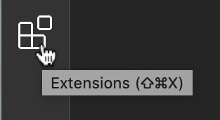
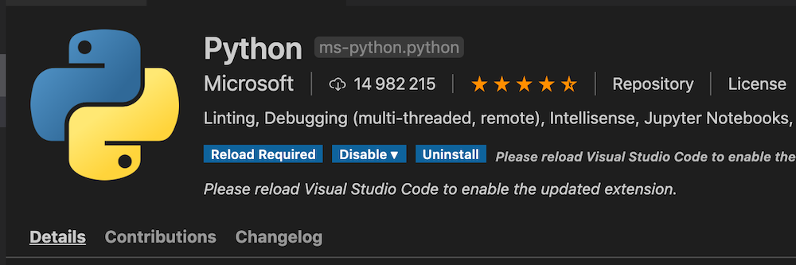
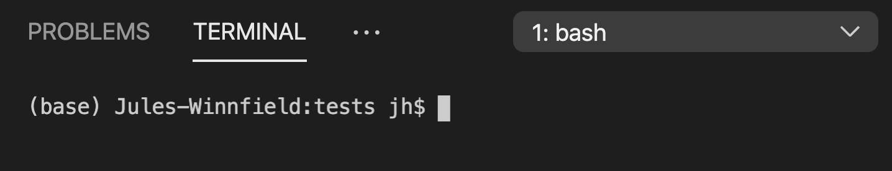
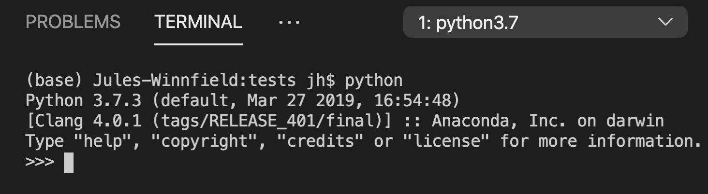

# 01 - Syllabus

## 9 janvier 2020

Je décrirai le syllabus et les objectifs généraux du cours.

Donné depuis 2016, ce cours en est à sa cinquième itération. À chaque année, j'essaie des choses, j'ajoute des contenus, j'en retranche.

Généralement, la structure du cours correspond au _« pipeline »_ du journalisme informatique, aux étapes de cette pratique :

1. On effectue la cueillette de l'information ou des données, souvent, grâce à de la programmation.
2. On analyse, ensuite, ces données, tout en faisant des entrevues ou en allant sur le terrain pour vérifier, pour contextualiser, pour incarner.
3. On raconte, enfin, l'histoire que recèle ces données grâce, entre autres, à des visualisations.

Mais cette année, j'ai relégué le volet visualisation au cours EDM4455 pour ajouter du contenu dans le volet analyse en vous montrant pour la première fois, cette année, l'analyse du langage naturel. Vous me direz si cela vous aura été utile.

La matière de ce cours est difficile. Difficile à apprendre pour vous. Difficile à enseigner pour moi.

J'ai confiance que vous pourrez y arriver. Dites-moi si le rythme est trop intense \(ou trop lent\). Je ne veux pas vous assomer. Je veux vous accompagner, dans la mesure de mes modestes capacités car, je le rappelle, ce que je ne connais pas est immense.

## Installfest

En terminant, vous devrez dès ce premier cours installer sur votre ordinateur deux outils gratuits dont nous nous servirons tout au long de la session et vous abonner à un service de partage de code grâce auquel vous allez remettre vos exercices.

Allons-y d'abord avec les deux outils. Il est important de les installer **DANS CET ORDRE**.

## D'abord Anaconda.

[**Anaconda**](https://www.anaconda.com/download) est ce qu'on appelle une « distribution » du langage Python. Il est possible de l'installer sur votre ordinateur, que vous ayez **Windows** ou **MacOSX**. Anaconda est devenu la distribution _de facto_ dans l'univers de l'analyse de données. Elle comprend plusieurs bibliothèques \(_librairies_ ou _packages_\) qui ne sont pas offerts par défaut dans Python. Vous n'aurez donc pas à les installer manuellement à chaque fois qu'on en apprendra une nouvelle.

Installez la version d'Anaconda pour **Python 3**.

## Ensuite Visual Studio Code

J'essaie [**Visual Studio Code**](https://code.visualstudio.com/Download) pour la première fois. C'est ce qu'on appelle un «environnement de développement». Après l'avoir installé sur votre ordinateur, vous serez aussi bien équipé\(e\) qu'un.e programmeur.euse professionnel\(le\). Ici encore, il en existe des versions pour Windows ou MacOSX.

Une fois que vous l'aurez installé, il vous manquera seulement d'ajouter une **extension**.

Cherchez l'extension pour python mise au point par Microsoft  \(`ms-python.python`\) et installez-la.

Une fois que tout cela sera fait, dans le menu Terminal de Visual Studio, choisissez «Nouveau Terminal». Dans l'un des espaces de Visual Studio, vous devriez voir le nom de votre ordinateur, suivi d'un signe de dollar \($\) et d'un gros curseur rectangulaire blanc.

Tapez simplement `python`.

Vous devriez avoir un résultat qui, sans être rigoureusement identique, devrait ressembler à ceci.

L'important est de lire python 3 quelque part. Envoyez-moi par [courriel](mailto:roy.jean-hugues@uqam.ca) une capture d'écran du résultat pour compléter le premier exercice de ce cours.

## Enfin, Github

Je vous ai déjà parlé de _git._ Il s'agit d'un système de contrôle des versions dans le monde du développement logiciel. Une des façons de s'en servir est par le biais de l'interface web offerte par **Github**.

Je vais vous demander de vous y abonner \(ça aussi, c'est gratuit\). Une fois cela fait, je vais vous demander de faire une copie \(_« fork »_\) du répertoire \(_« repo »_\) du syllabus du cours que vous trouverez sur le [compte Github du programme](https://github.com/Journalisme-UQAM).

Ce n'est pas une obligation, mais une fois abonné\(e\), vous pourrez choisir l'[option « éducation »](https://education.github.com/pack). Cette option vous permet d'accéder gratuitement à différents autres outils dont on ne se servira pas nécessairement au cours de la session, mais qui pourraient vous aider à réaliser votre travail final, voire vous être utiles dans votre future carrière de _hacker\(euse\)_.

