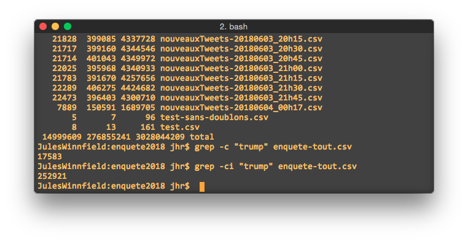

# 02 - UNIX

## 16 janvier 2020

Avant d'aborder UNIX, nous aurons la visite de Thomas Hurtut qui viendra nous expliquer les tenants et aboutissants du travail d'équipe que certain\(e\)s pourront réaliser avec ses étudiant\(e\)s.

Avec son interface héritée de l'époque de vos grands-parents, UNIX peut sembler rébarbatif. C'est pourtant un outil puissant qui aide encore de nombreux journalistes dans leurs tâches de tous les jours.

On va y voir quelques-unes des commandes les plus utiles, dont, entre autres:

* `cd`
* `ls`
* `cat`
* `grep`
* `curl`
* `wget`

Vous pourrez faire les exercices en classe avec le _terminal_ de votre ordi ou de _Visual Studio_.

Pour référence, voici quelques-unes des [commandes Unix les plus utiles en journalisme](https://medium.com/@jeanhuguesroy/unix-pour-journalistes-1352aad18f2a).

