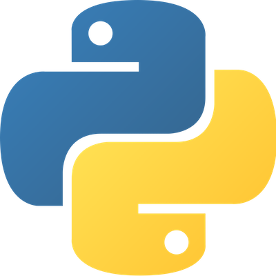

# Méthode

Le contenu de ce cours colle davantage à ce qu'on appelle, dans le monde anglo-saxon, du [_Computational journalism_](https://cj2020.northeastern.edu/). Il s'agit de l'application de l'informatique au journalisme. Ce syllabus même est un exemple de ce qu'on peut faire avec ces technologies. Il repose sur un système appelé [_git_](https://fr.wikipedia.org/wiki/Git), qui permet de collaborer à plusieurs sur un même projet. _Git_ est l'une des technologies que l'on appréhendera ensemble au cours de la session.

Mais ce qu'on fera, surtout, c'est d'apprendre la **programmation** et ses usages journalistiques.

Le langage qu'on utilisera s'appelle [**Python**](https://www.python.org/).

Plus concrètement, on s'en servira pour :

* **moissonner** des données, ou faire du _data scraping,_
* faire du **traitement du langage naturel** \(ou _Natural Language Processing \[NLP\]_\), ce qui est considéré par certains comme une forme d'intelligence artificielle,
* **analyser** des données lorsqu'elles sont trop volumineuses pour un tableur comme _Excel_ ou _Calc_ de LibreOffice.

On verra également quelques commandes de base dans un bon vieux système appelé **UNIX**.

Si le temps le permet, on tentera enfin de se familiariser avec le [_**Structured Query Language \(SQL\)**_](https://fr.wikipedia.org/wiki/Structured_Query_Language) dont je vous ai parlé dans le cours EDM4455, qui est le langage de la plupart des bases de données.

### Ce cours est un échange

Je reste ouvert à vos **demandes spéciales**. Vous avez entendu parler d'un projet, d'une technologie, d'une application particulière en journalisme? Si je puis vous aider à l'appréhender, voire la réaliser, je vais tâcher de le faire. La meilleure façon d'apprendre est avec un projet concret.

Inversement, si vous connaissez une technique, un outil, un truc, n'hésitez jamais à le **partager** avec l'ensemble du groupe. Parlez-m'en au préalable et on pourra prévoir une période dans le prochain cours pour que vous puissiez nous le ou la présenter. Si vous pouvez vous aussi m'apprendre quelque chose, je serai le prof le plus heureux du monde.

