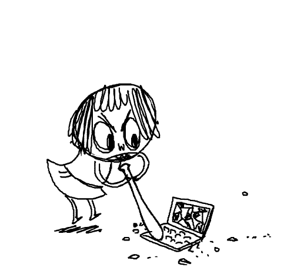

# Critères d'évaluation

Comme la matière de ce cours est particulièrement difficile, voire totalement étrangère à tout ce que vous avez fait jusqu'à maintenant dans votre cursus, je suis assez conciliant en ce qui a trait aux notes.

## Pour les scripts

Si vos scripts ne fonctionnent pas, ne vous en faites pas. Racontez-moi, dans les commentaires que vous laisserez dans vos scripts, ce que vous avez tenté de faire pour que ça fonctionne, les questions que vous avez posées sur le web, les sites que vous avez visités ou la documentation que vous avez lue. Ces efforts ont une valeur et se mériteront au moins un **B**, voire un **B+**.

Vous conviendrez que les notes de **A-**, **A** ou **A+** seront réservées à celles et ceux qui auront des scripts fonctionnels et bien documentés.

Les notes égales ou inférieures à **B-**, cependant, sont toujours possibles si l'effort n'est manifestement pas au rendez-vous ou si le plagiat est manifeste.

Rappelez-vous qu'il sera possible de ne rien comprendre. Vous pourrez ressentir une intense frustration qui ne m'est pas étrangère. Il m'arrive fréquemment de rager et d'avoir envie de défenestrer mon ordinateur. Ne vous laissez pas paralyser. N'hésitez pas, non plus, à demander de l'aide \(m'écrire, m'appeler ou venir me voir à mon bureau\).

## Travail final et _making-of_

* Effort.
* Intérêt public.
* Originalité.

Ici encore, il est possible que vous n'y arriviez pas. Ne vous sentez pas _poche_. Plusieurs étudiant\(e\)s des sessions précédentes n'ont pas été en mesure de compléter un projet final. Soyez néanmoins certains que vos efforts auront une valeur à mes yeux. Un _making-of_ détaillé et bien documenté aussi!

